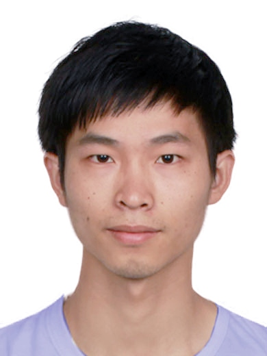

<html>
  <html lang="en"><head><meta http-equiv="Content-Type" content="text/html; charset=UTF-8">
        <title>Lechao Cheng's Homepage </title>
        <link rel="stylesheet" type="text/css" href="stylesheet.css">
</head>
    <body><table border=0 width=980px align=center><tr><td>
    
        <td valign="top">

         
        <table style="font-size: 11pt;" border=0 width=100%>
            <tr>

                <td>
                     
                      

                        <name>Lechao Cheng</name>
                        <!--     -->
                      

                    
                     
                        Ph.D in Computer Science 
                        Department of Computer Science 
                        Zhejiang University  
                        <a href="mailto:chenglc@zhejianglab.com">E-mail</a> &nbsp/&nbsp
                        <!-- <a href="">Google Scholar</a> &nbsp/&nbsp
                        <a href="">Twitter</a> &nbsp/&nbsp -->
                        <a href="https://github.com/liygcheng"> Github </a> 
                    
                </td>
                <td width = "30%">
                    
                        </td>
            </tr>
        </table> 

        
        <!--   -->
        <heading>Biography</heading>
        

        Lechao Cheng received Ph.D degree from <a href="http://www.zju.edu.cn/english/">Zhejiang University</a>, supervised by <a href="http://www.cad.zju.edu.cn/home/zywang/">Prof. Zhangye Wang</a> and <a href="http://www.cad.zju.edu.cn/home/chenwei/">Prof. Wei Chen</a>.
		His research area centres around Computational Photography, Knowledage Distillation, Few-shot Learning and Fine-grained Image Classification. He serves as a technical program committee (TPC) member for ACM Multimedia 2020, and reviewer for Neurocomputing, ACM Multimedia 2020,
		CVPR2021,ICCV2021.
        

        <!-- <h2>News</h2>
           
        <ul>
        <li><strong>[12/2020]</strong>  Our HiGAN is finally accepted by IJCV at the end of 2020!!  </li>
        <li><strong>[10/2020]</strong>  Our extended InterFaceGAN is accepted by T-PAMI.  </li>
        <li><strong>[09/2020]</strong>  We release <a href="https://github.com/genforce/genforce"> GenForce</a>, an efficient PyTorch library for deep generative modeling.  </li>
        <li><strong>[07/2020]</strong>  One paper to appear in ECCV'2020. </li>
        <li><strong>[04/2020]</strong>  HiGAN (short) to appear in <a href="http://visual.cs.brown.edu/aicc2020/"> AI for Content Creation Workshop, CVPR 2020</a>.  </li>
        <li><strong>[02/2020]</strong>  One paper to appear in CVPR'2020.  </li>
        <li><strong>[03/2019]</strong>  One paper to appear in CVPR'2019.  </li>
        <li><strong>[06/2018]</strong>  Two papers to appear in ECCV'2018. </li>
        </ul> 
         -->

        <!-- <heading>Experiences</heading> -->
        <!--       -->
        <!-- <ul> -->
                <!-- <li><si> Research Intern, Visual Computing Group, Microsoft Research Aisa.</si> -->
        <!--   Nov. 2018 - May. 2019 -->
        <!--   Supervised by: <a href="http://dahua.me/">Jifeng Dai</a>, <a href="https://ancientmooner.github.io/">Han Hu</a>, <a href="https://www.microsoft.com/en-us/research/people/stevelin/">Steve Lin</a>.</li> -->
        <!-- <li> -->
        
        <!-- <si> Research Intern, Visual Computing Center, University of California San Diego.</si> -->
        <!--   Jul. 2018 - Sep. 2018. -->
        <!--   Supervised by: <a href="https://cseweb.ucsd.edu/~haosu/">Hao Su</a>.</li> -->
        <!-- </ul> -->
   
        <!--         -->

        <!-- <h2>Preprints</h2>
        
        <ul>
        <li><strong>[07/2020]</strong>  Generative Hierarchical Features from Synthesizing Images [<a href="https://arxiv.org/pdf/2007.10379.pdf">PDF</a>]  </li>
        <li><strong>[07/2020]</strong>  Unsupervised Landmark Learning from Unpaired Data [<a href="https://arxiv.org/pdf/2007.01053.pdf">PDF</a>]  </li>
        <li><strong>[06/2020]</strong>  Video Representation Learning with Visual Tempo Consistency [<a href="https://arxiv.org/pdf/2006.15489.pdf">PDF</a>]  </li>
        </ul>
         -->

        <!-- <heading>Selected Publications <small>[<a href="./pub.html">Full list</a>]</small> </heading> -->
		<heading>Selected Publications</heading>
        
            <table cellspacing="17">

                <!-- <tr> -->
                  <!-- <td width="30%"> -->
                      <!--  -->
                          <!-- </td> -->
                  <!-- <td> -->
                  <!-- <strong>Visual Boundary Knowledge Translation for Foreground Segmentation</strong> -->
                  <!--   -->
                  <!-- Zunlei Feng*, <strong>Lechao Cheng*</strong>, Xinchao Wang, Xiang Wang, Yajie Liu,Xiangtong Du,Mingli Song. -->
                  <!--   -->
                  <!-- <em>Thirty-Fifth AAAI Conference on Artificial Intelligence(<b>AAAI</b>)</em>, 2021. -->
                  <!--   -->
                  <!-- [<a href="https://arxiv.org/pdf/2007.10379.pdf">Paper</a>][<a href="https://genforce.github.io/ghfeat/">Webpage</a>][<a href="https://github.com/genforce/ghfeat">Code</a>] -->
                  <!--   -->
                  <!-- </td> -->
                  <!-- </tr> -->

                <tr>
                  <td width="30%">
                    
                            </td>
                    <td>
                    <strong>Intrinsic Image Transformation Via Scale Space Decomposition</strong>
                     
                    <strong>Lechao Cheng</strong>, Chengyi Zhang, Zicheng Liao.
                     
                    <em>IEEE Conference on Computer Vision and Pattern Recognition</em> (<b>CVPR</b>), 2018.
                    <!--   -->
                    <!-- [<a href="https://arxiv.org/pdf/2007.01053.pdf">Paper</a>][<a href="https://github.com/justimyhxu/ULTRA">Code</a>] -->
                    <!--   -->
                    </td>
                </tr>

                
                <!-- <tr> -->
                  <!-- <td width="30%"> -->
                    <!--  -->
                          <!-- </td> -->
                  <!-- <td> -->
                  <!-- <strong>Dense RepPoints: Representing Visual Objects with Dense Point Sets,</strong> -->
                  <!--   -->
                  <!-- <strong>Yinghao Xu*</strong>, <a href='https://www.yangze.tech/'>Ze Yang*</a>, Han Xue*, <a href='https://stupidzz.github.io'>Zheng Zhang</a>, <a href='http://www.cs.toronto.edu/~urtasun/'>Raquel Urtasun</a>, <a href='http://www.liweiwang-pku.com/'>Liwei Wang</a>, <a href='https://scholar.google.com/citations?user=c3PYmxUAAAAJ&hl=en'>Steve Lin</a>, <a href='https://ancientmooner.github.io/'>Han Hu</a>. -->
                  <!--   -->
                  <!-- <em>IEEE European Conference on Computer Vision</em> (<b>ECCV</b>), 2020. -->
                  <!--   -->
                  <!-- [<a href="https://arxiv.org/pdf/1912.11473.pdf">Paper</a>][<a href="https://github.com/justimyhxu/Dense-RepPoints">Code</a>] -->
                  <!--   -->
                  <!-- </td> -->
                <!-- </tr> -->

                <!-- <tr> -->
                  <!-- <td width="30%"> -->
                    <!--  -->
                            <!-- </td> -->
                    <!-- <td> -->
                    <!-- <strong>Temporal Pyramid Network for Action Recognition,</strong> -->
                    <!--   -->
                    <!-- <a href="https://ceyuan.me">Ceyuan Yang*</a>, <strong>Yinghao Xu*</strong>, <a href="http://shijianping.me/">Jianping Shi</a>, <a href="http://daibo.info/">Bo Dai</a>, <a href="http://bzhou.ie.cuhk.edu.hk/">Bolei Zhou</a>. -->
                    <!--   -->
                    <!-- <em>IEEE Conference on Computer Vision and Pattern Recognition</em> (<b>CVPR</b>), 2020. -->
                    <!--   -->
                    <!-- [<a href="https://arxiv.org/pdf/2004.03548.pdf">Paper</a>][<a href="https://decisionforce.github.io/TPN/">Webpage</a>][<a href="https://github.com/decisionforce/TPN">Code</a>] -->
                    <!--   -->
                    <!-- </td> -->
                <!-- </tr> -->

                <!-- <tr> -->
                  <!-- <td width="30%"> -->
                    <!--  -->
                          <!-- </td> -->
                  <!-- <td> -->
                  <!-- <strong>A Main/Subsidiary Network Framework for Simplifying Binary Networks,</strong> -->
                  <!--   -->
                  <!-- <strong>Yinghao Xu*</strong>, <a href="http://www.simonxin.com/">Xin Dong*</a>, <a>Yudian Li</a>, <a href="http://cseweb.ucsd.edu/~haosu/">Hao Su</a>. -->
                  <!--   -->
                  <!-- <em>IEEE Conference on Computer Vision and Pattern Recognition</em> (<b>CVPR</b>), 2019. -->
                  <!--   -->
                  <!-- [<a href="https://arxiv.org/pdf/1812.04210.pdf">Paper</a>] [<a href="https://github.com/justimyhxu/MainSubsidaryBNN">Code</a>] -->
                  <!--   -->
                  <!-- </td> -->
              <!-- </tr> -->
                
                    
            </table>
        

        <heading>Publication</heading>
         
		 <table cellspacing="17">
				<tr>
                    <td>
                    <strong>Visual Boundary Knowledge Translation for Foreground Segmentation,</strong>
                     
                    Zunlei Feng*,<strong>Lechao Cheng</strong>*,Xinchao Wang,Xiang Wang,Yajie Liu,Xiangtong Du,Mingli Song
                     
                    <em>Thirty-Fifth AAAI Conference on Artificial Intelligence(<b>AAAI</b>)</em>, 2021.
                    </td>
                </tr>
				<tr>
                    <td>
                    <strong>Edge-competing Pathological Liver Vessel Segmentation with Limited Labels,</strong>
                     
                    Zunlei Feng, Zhonghua Wang, Xinchao Wang, Xiuming Zhang,<strong>Lechao Cheng</strong>,Yuexuan Wang,Mingli Song
                     
                    <em>Thirty-Fifth AAAI Conference on Artificial Intelligence(<b>AAAI</b>)</em>, 2021.
                    </td>
                </tr>

				<tr>
                    <td>
                    <strong>Facial Image Inpainting via Variational Autoencoder,</strong>
                     
                    Xuefei Zhang,<strong>Lechao Cheng</strong>,Shengli Bai,Fan Zhang,Nongliang Sun,Zhangye Wang
                     
                    <em>Journal of Computer-Aided Design & Computer Graphics </em>, 2020.
                    </td>
                </tr>

				<tr>
                    <td>
                    <strong>A Synthesis-By-Analysis Network with Applications in Image Super-Resolution,</strong>
                     
                    <strong>Lechao Cheng</strong>, Zhangye Wang
                     
                    <em>Proceedings of Computer Graphics International Conference </em>, 2019.
                    </td>
                </tr>

				<tr>
                    <td>
                    <strong>Exploiting Non-Local Relationships For Dense Video Captioning,</strong>
                     
                    <strong>Lechao Cheng</strong>, Xiaowei Zhao,Zicheng Liao,Yang Liu
                     
                    <em>Proceedings of the British Machine Vision Conference </em>, 2018.
                    </td>
                </tr>
		        
				<tr>
                    <td>
                    <strong>Intrinsic Image Transformation via Scale Space Decomposition,</strong>
                     
                    <strong>Lechao Cheng</strong>, Chengyi Zhang, Zicheng Liao
                     
                    <em>IEEE Conference on Computer Vision and Pattern Recognition</em>, 2018.
                    </td>
                </tr>
				
                <tr>
                    <td>
                    <strong>Synthesizing the Four Seasons of a Scene from Large-Scale Web Images,</strong>
                     
                    <strong>Lechao Cheng</strong>, Zicheng Liao, Zhangye Wang 
                     
                    <em>Journal of Computer-Aided Design & Computer Graphics</em>, 2017.
                    </td>
                </tr>
				
                <tr>
                    <td>
                    <strong>AudeoSynth:Music-Driven Video Montage,</strong>
                     
                    Zicheng Liao, Yizhou Yu, Bingcheng Gong, <strong>Lechao Cheng</strong>
                     
                    <em>ACM Trans. Graphics(<b>SIGGRAPH</b>)</em>, 2015.
                    </td>
                </tr>
		</table>
            <!-- <ul> -->
        <!-- <li>Conference Reviewer for CVPR, ECCV, AAAI.</li> -->
        <!-- </ul> -->
        

        <!-- <heading>Selected Honors & Awards        </heading> -->
        <!--   -->
            <!-- <ul> -->
        <!-- <li>National Scholarship,                                                      2018 </li> -->
        <!-- <li>Tang Lixin Scholarship,                                                  2018 </li> -->
        <!-- <li> First Class Scholarship for Academic Excellence,                          2018,2017  </li> -->
        <!-- <li> Government Scholarship of Zhejiang Province,                              2017,2016 </li> -->
        <!-- <li> Meritorious Winner, Interdisciplinary Contest In Modeling(ICM),           2018 </li> -->
        <!-- <li> First Prize of Mathematics competition of Chinese College Students,       2017 </li> -->
        <!-- </ul> -->
        <!--  -->
      
            </body>

</html>
